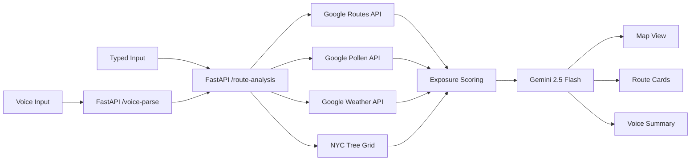

# treeroute

treeroute is a hackathon-winning multimodal walking route planner for allergy-sensitive New Yorkers.

It helps people choose safer walking routes by combining:

- NYC street tree census data
- live pollen conditions
- live weather and wind
- Google Maps routing
- Gemini-generated grounded explanations

Instead of showing only the fastest path, treeroute ranks 2-3 walking routes by likely pollen exposure so users can walk safer, not just faster.

Built for the NYC Build With AI Hackathon.

Live demo:
https://treeroute-501252220143.us-central1.run.app/


## Why It Stands Out

- Real public-interest use case: safer outdoor navigation for allergy-sensitive residents.
- Multimodal experience: voice in, visual map output, voice summary out.
- Strong AI usage: Gemini is used for voice parsing and grounded route explanation synthesis.
- Civic + live data blend: NYC Tree Census plus Google Routes, Pollen, and Weather APIs.
- End-to-end demo flow: landing page, registration, route planner, map, scoring, and explanation output.

## Core Experience

The product flow is:

`/ -> /register -> /planner`

1. A user enters a starting point and destination by typing or voice.
2. The route draft is saved locally.
3. The user registers once with allergy sensitivity and tree-trigger preferences.
4. The planner loads the saved route and analyzes alternative walking paths.
5. treeroute ranks the routes by expected pollen exposure and explains the recommendation.

## Multimodal UX

| Modality | Implementation |
|---|---|
| Speak | Web Speech API mic button for route input |
| Hear | `speechSynthesis` reads the best route recommendation aloud |
| See | Google Maps route overlay, markers, and hotspot visualization |

Voice input is parsed through the FastAPI `/voice-parse` endpoint, which uses Gemini with a regex fallback.

## What The App Does

- Collects route intent on a branded landing page
- Requires a lightweight allergy profile before route analysis
- Supports specific tree-trigger selection or general tree avoidance
- Generates 2-3 walking route alternatives
- Scores routes using tree density, species overlap, pollen, wind, humidity, and sensitivity
- Displays route cards, exposure scores, and map hotspots
- Produces grounded natural-language explanations for why one route is safer

## Tech Stack

- Next.js 16 App Router
- React + TypeScript
- Python + FastAPI backend
- Google Maps JavaScript API
- Google Routes API
- Google Pollen API
- Google Weather API
- Google GenAI SDK with Gemini 2.5 Flash
- NYC 2015 Street Tree Census
- Vitest
- Docker + Cloud Run deployment path

## Architecture



The app now runs as a split architecture:

- `Next.js` serves the React frontend
- `FastAPI` serves the runtime backend in `backend/app`

The browser calls FastAPI directly using `NEXT_PUBLIC_FASTAPI_BASE_URL`.
Legacy TypeScript server modules remain in the repo as rewrite references and testable domain code, but they are no longer used as runtime API endpoints.

The agent path declares tools for:

- fetching walking routes
- fetching pollen data
- fetching weather data
- scoring route exposure

Those signals are gathered in parallel, scored against the tree grid, and then passed to Gemini as grounded context for final explanations.

## Scoring Model

Route exposure is computed by:

1. Decoding each route polyline
2. Sampling points along the path
3. Looking up each sampled point in the tree-grid cells
4. Measuring canopy burden and species overlap with the user's profile
5. Adjusting the result with pollen, wind, humidity, route duration, and user sensitivity
6. Ranking routes from lowest to highest exposure

This means a slightly longer walk can rank higher if it avoids denser or more trigger-heavy canopy pockets.

## Demo Scenario

Try the app with:

- From: `Washington Square Park, New York, NY`
- To: `Lincoln Center, New York, NY`
- Triggers: `oak`, `birch`, `maple`
- Sensitivity: `medium` or `high`

Or say:

`from Washington Square Park to Lincoln Center`

This scenario is tuned to show a visible tradeoff between route speed and allergy exposure.

## Local Setup

1. Install dependencies:

```bash
npm install
```

2. Create a `.env.local` file in the project root, or copy `.env.example`:

```bash
NEXT_PUBLIC_GOOGLE_MAPS_API_KEY=
NEXT_PUBLIC_FASTAPI_BASE_URL=http://localhost:8000
GOOGLE_MAPS_API_KEY=
GOOGLE_POLLEN_API_KEY=
GOOGLE_WEATHER_API_KEY=
GOOGLE_AI_API_KEY=
GEMINI_MODEL=gemini-2.5-flash
CORS_ALLOW_ORIGINS=http://localhost:3000
```

3. Start the Next.js app:

```bash
npm run dev
```

4. If you want to use the new Python backend, start FastAPI in a second terminal:

```bash
pip install -r backend/requirements.txt
uvicorn backend.app.main:app --reload --port 8000
```

5. Open `http://localhost:3000`

```bash
npm run check:fastapi
```

The script hits FastAPI directly and fails if `/health`, `/voice-parse`, or `/route-analysis` is not working.

## Commands

```bash
npm run dev
npm run build
npm run test
npm run check:fastapi
npm run build-tree-grid -- ./StreetTreeCensus.csv ./data/tree-grid.generated.json
npm run capture:readme-demo
npm run build:readme-demo-gif
```

## Key Files

| File | Role |
|---|---|
| `components/landing-page.tsx` | Landing page and route-intent capture |
| `components/register-page.tsx` | Registration and allergy-profile onboarding |
| `components/pollen-safe-app.tsx` | Main planner UI, analysis flow, and speech output |
| `components/voice-button.tsx` | Speech recognition UI with Gemini + local parsing fallback |
| `components/route-map.tsx` | Route rendering and hotspot overlays on Google Maps |
| `backend/app/main.py` | FastAPI app and HTTP endpoints |
| `backend/app/route_analysis.py` | Python route-analysis orchestration pipeline |
| `backend/app/providers.py` | Python integrations for Maps, Weather, Pollen, and Gemini |
| `backend/app/scoring.py` | Python route-scoring logic |
| `backend/app/tree_grid.py` | Python tree-grid lookup and cache layer |
| `backend/app/voice_parse.py` | Python voice-command parsing pipeline |
| `lib/fastapi-client.ts` | Direct browser client for FastAPI |
| `scripts/build-tree-grid.ts` | CSV-to-grid preprocessing script |

## Data

The repository includes a demo tree grid in `data/tree-grid.sample.json`.

That sample is based on the NYC 2015 Street Tree Census and is used to score route exposure by neighborhood canopy burden and top tree species.

## Deployment

The app is configured for standalone Next.js output and includes a `Dockerfile` suitable for Cloud Run.

Example:

```bash
gcloud run deploy treeroute \
  --source . \
  --region us-central1 \
  --allow-unauthenticated \
  --set-env-vars GOOGLE_AI_API_KEY=...,GOOGLE_MAPS_API_KEY=...
```

## Team

| Name | Role | GitHub |
|---|---|---|
| Daniyar Abykhanov | Tech Lead | [@daniyar-udel](https://github.com/daniyar-udel) |
| Vera Vecherskaia | Expert | [@vvchrsk](https://github.com/vvchrsk) |
| Daniel Naumov | Expert | [@dnauminator](https://github.com/dnauminator) |
| Beibarys Nyussupov | Engineer | [@NBeibarys](https://github.com/NBeibarys) |
